# Convolutional Neural Network

A general purpose image processing model built without any math or machine learning libraries.

The ```ConvolutionalNeuralNetwork``` class manages initializing, saving, and retrieving network parameters, calculating feedforward output, determining loss on known inputs, single and batch training using gradient descent, and storing network state for analysis or chaining.

```cpp
/* Create Convolutional Neural Network Instance */

ConvolutionalNeuralNetwork myCNN(
    Dimensions(1, Shape(28, 28)), // input image dimensions: 1 channel of size 28x28
    {
        // convolution layer with 8 kernels of size 3x3 using stride=1, padding=1
        new ConvolutionLayerParameters(8, Shape(3, 3), 1, 1),

        // relu activation layer
        new ActivationLayerParameters(RELU),

        // convolutional layer with 16 kernels of size 3x3 using stride=1, padding=1
        new ConvolutionLayerParameters(16, Shape(3, 3), 1, 1),

        // max pool layer with window size 2x2 using stride=2, padding=0
        new PoolLayerParameters(MAX, Shape(2, 2), 2, 0)
    },
    {
        HiddenLayerParameters(64, RELU), // hidden layer with 64 nodes using relu activation

        HiddenLayerParameters(10, LINEAR) // output layer with 10 nodes using linear activation
    },
    SOFTMAX, // normalization function
    CATEGORICAL_CROSS_ENTROPY // loss function
);
```

```cpp
/* Initialize Parameters */

myCNN.initializeRandomFeatureLayerParameters();

// initial weight range -0.1 to 0.1, initial bias range -0.1 to 0.1
myCNN.initializeRandomHiddenLayerParameters(-0.1, 0.1, -0.1, 0.1);
```

```cpp
/* Load Parameters From A File */

myCNN.load("path/to/learnedParameters.json");

/* Save Parameters To A File */

myCNN.save("path/to/learnedParameters.json");
```

```cpp
/* Use TensorDataPoint For Training */

std::vector<TensorDataPoint> trainingDataPoints;

trainingDataPoints.emplace_back(
    Tensor(/* ...28x28x1 data... */), // input
    Matrix(/* ...10x1 data... */) // expected output
);

// ... add other training data ...
```

```cpp
/* Train Using A Single TensorDataPoint */

float learningRate = 0.1;

myCNN.train(trainingDataPoints[0], learningRate);
```

```cpp
/* Train Using A Batch */

float learningRate = 0.05;

myCNN.batchTrain(trainingDataPoints, learningRate);
```

```cpp
/* Make A Prediction */

Tensor input = Tensor(/* ...28x28x1 data... */ );

Matrix output = myCNN.calculateFeedForwardOutput(input);
```

```cpp
/* Calculate The Loss For A Known Point */

Matrix expectedOutput = Matrix(/* ...10x1 data... */);

float loss = myCNN.calculateLoss(input, expectedOutput);
```

## MNIST Digit Classification Example


### Network Structure and Initialization

```cpp
ConvolutionalNeuralNetwork cnn = ConvolutionalNeuralNetwork(
    Dimensions(1, Shape(28, 28)),
    {
        new ConvolutionLayerParameters(8, Shape(3, 3), 1, 1),
        new ActivationLayerParameters(RELU),
        new ConvolutionLayerParameters(16, Shape(3, 3), 1, 1),
        new PoolLayerParameters(MAX, Shape(2, 2), 2, 0)
    },
    {
        HiddenLayerParameters(64, RELU),
        HiddenLayerParameters(10, LINEAR)
    },
    SOFTMAX,
    CATEGORICAL_CROSS_ENTROPY
);

cnn.initializeRandomFeatureLayerParameters();
cnn.initializeRandomHiddenLayerParameters(-0.1, 0.1, -0.1, 0.1);
```

### Training Progression

The model was trained in randomly partitioned batches of 1200 images on a dataset of 60k images.

The loss and accuracy were calculated against a separate testing dataset of 10k images.

<table border="1">
  <tr>
    <th>Epoch</th><th>0</th><th>1</th><th>2</th><th>3</th><th>4</th><th>5</th>
  </tr>
  <tr>
    <td>Loss</td><td>4.06674</td><td>0.53085</td><td>0.28210</td><td>0.23416</td><td>0.17990</td><td>0.15610</td>
  </tr>
  <tr>
    <td>Accuracy</td><td>0.1494</td><td>0.8453</td><td>0.9162</td><td>0.9296</td><td>0.9451</td><td>0.9518</td>
  </tr>
</table>

### Feature Analysis

Visualizing the outputs of different layers gives insight into how certain features of the data are used.

Each channel roughly represents one feature that a convolutional kernel identifies.

To explore this, we can look at snapshots of the output channels throughout the feedforward process:

### Layer 1 (Convolution)

Each channel can be identified as roughly one type of feature (vertical line, bottom left corner, etc).

| Digit   | 0 | 1 | 2 | 3 | 4 | 5 | 6 | 7 | 8 | 9 |
|---------|---|---|---|---|---|---|---|---|---|---|
| Channel 0 |  | 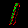 |  | 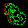 |  | 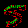 | 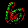 | 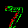 | 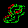 | 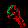 |
| Channel 1 | 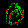 | 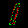 |  |  |  | 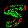 |  | 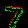 | 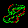 | 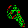 |
| Channel 2 | 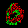 | 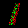 |  | 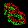 |  |  | 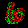 |  |  | 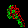 |
| Channel 3 | 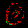 | 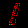 | 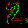 | 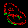 | 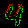 |  | 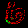 |  |  | 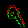 |
| Channel 4 |  | 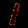 |  | 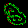 |  |  |  |  |  | 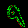 |
| Channel 5 | 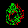 | 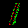 |  | 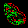 | 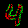 |  | 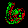 |  | 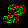 | 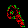 |
| Channel 6 | 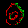 |  |  | 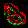 |  | 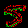 |  |  | 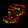 | 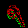 |
| Channel 7 | 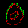 | 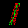 | 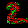 | 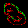 |  | 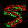 | 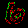 | 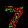 | 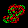 | 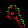 |

### Layer 2 (Relu Activation)

Looks like most of the layers got zeroed out? Either unlucky initial bias + relu or an odd training choice. Gives insight into which activations may be dangerous early on

| Digit   | 0 | 1 | 2 | 3 | 4 | 5 | 6 | 7 | 8 | 9 |
|---------|---|---|---|---|---|---|---|---|---|---|
| Channel 0 |  |  | 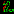 |  |  |  |  |  |  |  |
| Channel 1 |  |  |  |  |  |  |  |  |  |  |
| Channel 2 |  |  |  |  |  |  |  |  |  |  |
| Channel 3 |  |  |  |  |  |  |  |  |  |  |
| Channel 4 |  |  |  |  |  |  |  |  |  |  |
| Channel 5 |  |  |  |  |  |  |  |  |  |  |
| Channel 6 |  |  |  |  |  |  |  |  |  |  |
| Channel 7 |  |  |  |  |  |  |  |  |  |  |

### Layer 3 (Convolution)

Again we see many distinct features for a given kernel.

| Digit     | 0 | 1 | 2 | 3 | 4 | 5 | 6 | 7 | 8 | 9 |
|-----------|---|---|---|---|---|---|---|---|---|---|
| Channel 0  |  |  |  |  |  |  |  |  |  |  |
| Channel 1  |  |  |  |  |  |  |  |  |  |  |
| Channel 2  |  |  |  |  |  |  |  |  |  |  |
| Channel 3  |  |  |  |  |  |  |  |  |  |  |
| Channel 4  |  |  |  |  |  |  |  |  |  |  |
| Channel 5  |  |  |  |  |  |  |  |  |  |  |
| Channel 6  |  |  |  |  |  |  |  |  |  |  |
| Channel 7  |  |  |  |  |  |  |  |  |  |  |
| Channel 8  |  |  |  |  |  |  |  |  |  |  |
| Channel 9  |  |  |  |  |  |  |  |  |  |  |
| Channel 10 |  |  |  |  |  |  |  |  |  |  |
| Channel 11 |  |  |  |  |  |  |  |  |  |  |
| Channel 12 |  |  |  |  |  |  |  |  |  |  |
| Channel 13 |  |  |  |  |  |  |  |  |  |  |
| Channel 14 |  |  |  |  |  |  |  |  |  |  |
| Channel 15 |  |  |  |  |  |  |  |  |  |  |

### Layer 4 (Max Pool)

A large reduction in information density while maintaining a useful feature map. The pixels of these channels go on to feed the neural network.

| Digit     | 0 | 1 | 2 | 3 | 4 | 5 | 6 | 7 | 8 | 9 |
|-----------|---|---|---|---|---|---|---|---|---|---|
| Channel 0  |  |  |  |  |  |  |  |  |  |  |
| Channel 1  |  |  |  |  |  |  |  |  |  |  |
| Channel 2  |  |  |  |  |  |  |  |  |  |  |
| Channel 3  |  |  |  |  |  |  |  |  |  |  |
| Channel 4  |  |  |  |  |  |  |  |  |  |  |
| Channel 5  |  |  |  |  |  |  |  |  |  |  |
| Channel 6  |  |  |  |  |  |  |  |  |  |  |
| Channel 7  |  |  |  |  |  |  |  |  |  |  |
| Channel 8  |  |  |  |  |  |  |  |  |  |  |
| Channel 9  |  |  |  |  |  |  |  |  |  |  |
| Channel 10 |  |  |  |  |  |  |  |  |  |  |
| Channel 11 |  |  |  |  |  |  |  |  |  |  |
| Channel 12 |  |  |  |  |  |  |  |  |  |  |
| Channel 13 |  |  |  |  |  |  |  |  |  |  |
| Channel 14 |  |  |  |  |  |  |  |  |  |  |
| Channel 15 |  |  |  |  |  |  |  |  |  |  |
